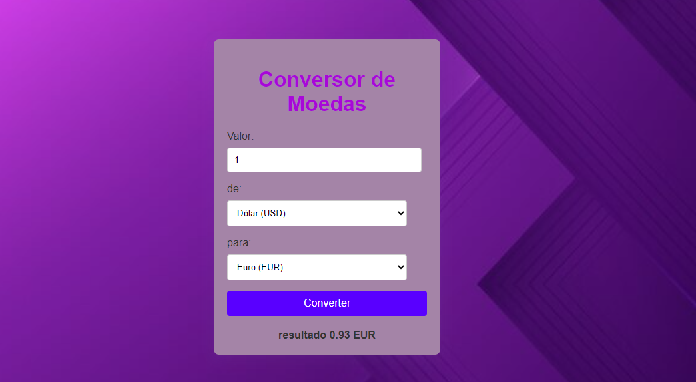

### Conversor de Moedas 🪙
Este projeto é um simples conversor de moedas, permitindo que os usuários convertam valores entre o Real (BRL), Dólar (USD) e Euro (EUR). O projeto consiste em um arquivo HTML para a interface do usuário e um arquivo JavaScript que contém a lógica de conversão.

Um conversor de moedas simples desenvolvido em HTML, CSS e JavaScript. O projeto permite a conversão entre as moedas: Real (BRL), Dólar (USD) e Euro (EUR).

## Visão Geral 🔍

Este aplicativo web permite que os usuários insiram um valor em uma moeda e o converta para outra moeda selecionada. As taxas de câmbio são baseadas em valores fixos, mas você pode facilmente modificar para usar uma API de taxas de câmbio reais.

## Funcionalidades 💎

- **Conversão de Moedas**: Converte valores entre BRL, USD e EUR.
- **Interface Simples**: Formulário fácil de usar com opções de seleção.
- **Resultados Imediatos**: Exibição instantânea do valor convertido.

## Tecnologias Utilizadas 🛠

- **HTML**: Estrutura da página.
- **CSS**: Estilização (inclua seu arquivo `main.css` para estilização).
- **JavaScript**: Lógica de conversão de moeda (veja `main.js`).

### Como Funciona? 🤔

Digite o valor que deseja converter no campo "Valor".
Selecione a moeda de origem no menu suspenso "de:".
Selecione a moeda de destino no menu "para:".
Clique em "Converter" para ver o resultado da conversão.
Exemplo
Suponha que você queira converter 100 USD para BRL:

Insira 100 no campo de valor.
* Selecione USD como moeda de origem.
* Selecione BRL como moeda de destino.
* Clique em "Converter" para visualizar o valor convertido.
* Melhorias Futuras
* Implementar chamadas a uma API para obter taxas de câmbio em tempo real.
* Adicionar suporte a mais moedas.
* Melhorar a interface do usuário com CSS avançado ou frameworks como Bootstrap.

# Contribuições 💙
Contribuições são bem-vindas! Sinta-se à vontade para abrir issues ou pull requests.

# Licença 🔅
* Este projeto está licenciado sob a MIT License.

# Contato 📞
* Para mais informações, entre em contato:

## Email: gabrielaalves02984@gmail.com

## Melhorias Futuras
Taxas de Câmbio em Tempo Real: Integrar uma API para obter taxas de câmbio atualizadas.
Validação Adicional: Melhorar a validação dos campos de entrada.
Estilização: Adicionar um arquivo CSS (main.css) para melhorar a aparência do formulário.

 ## Descrição do Código
. Taxas de Câmbio: O objeto exchangeRates armazena as taxas de conversão entre as moedas. Cada moeda tem um objeto que define sua taxa em relação às outras.

. Evento de Submissão: Um ouvinte de evento é adicionado ao formulário. Quando o formulário é enviado, a função impede o envio padrão e executa a lógica de conversão.

. Recuperação de Valores: O valor inserido, a moeda de origem e a moeda de destino são capturados.

. Conversão: Se a moeda de origem e a de destino forem as mesmas, exibe o valor original. Caso contrário, calcula o valor convertido usando a taxa de câmbio correspondente e exibe o resultado.

* FOTO DO PROJETO 💜

